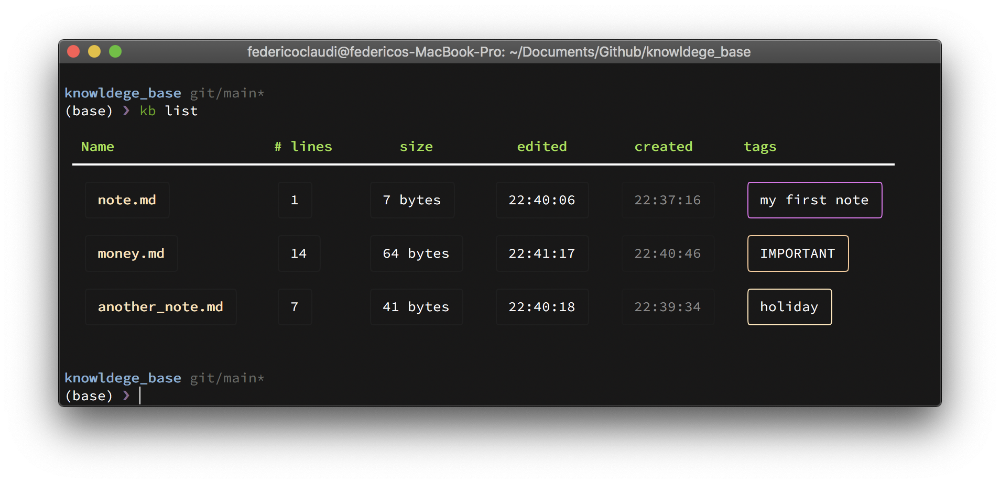

# Donote
The minimalist note editor for your terminal. 


**Create** notes...
**Edit** notes...
**Save** notes...




`donote` is a python implementation of a minimalist note editor for your terminal.
It facilitates creating, editing and managing notes as `markdown` files.

As such, it provides a CLI with the followng sintax:
```shell
dono <command> <note_name (optional)> <tag (optional)>
```

The **commands** include:

- `note l/list` to list all notes
- `note show <note_name>` to render a single note in the terminal
- `note e/edit <note_name>` to edit an existing note
- `note rm/remove <note_name>` to delete a note
- `note n/new <note_name>` to create a new note with a given Name
- `note t/tag <note_name> <tag>` to add a new tag to an existing note
- `note untag <note_name> <tag>` to remove a tag to an existing note


Editing a note opens the markdown file using `nano`, other editors can be used to edit the `.md` files externally.


## Installation
```
    pip install donote
```

**Disclaimer**: `donote` is a personal project, as such the path to where the notes are saved on my machine are hardcoded. If you want to use `donote` let me know and we can improve this (or you can fork this repository and alter the paths).


**Built with `rich` and `pyinspect`**
